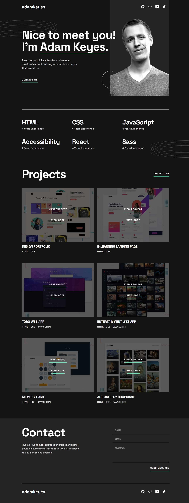

# Single-Page Developer Portfolio

## About This Project
The objective of this project was to translate a design spec into a fully-responsive portfolio website. This is a solution to the [Single-page developer portfolio challenge on Frontend Mentor](https://www.frontendmentor.io/challenges/singlepage-developer-portfolio-bBVj2ZPi-x). The provided design spec is for a *fictional* client. 

## How to Use / Functionality
This project is static and fully-responsive across various device sizes. By default, the website is *fictional*, thus all the **links** use placeholder addresses. Users have the functionality to:
- Click through to the individual's social profiles
- View relevant skills and years of experience
- View projects and click through to the respective repositories and site URLs
- Submit a basic form to a user. (This project is not wired up to send an email, just to provide front-end form validation)
- See hover and focus states for all interactive elements on the page
- View the optimal layout for the interface depending on their device's screen size
- Receive an error message when the form is submitted if:
  - Any field is empty
  - The email address is not formatted correctly

## Live Site URL
[Preview the site here (hosted via Netlify)](https://chimerical-selkie-e9a9da.netlify.app)

## Development Process
- Used a mobile-first approach for writing the CSS. Utilized two *breakpoint* media queries to adapt the layout for larger devices (Tablet, Desktop)
- Used a *container* class to set the max-width of the different sections, allowing for full-width backgrounds
- Utilized various *flexbox* properties to achieve the desired responsiveness and to match the design spec. Adjusted those properties within the two major breakpoints to adapt the layout to larger devices
- Used *CSS Grid* to overlay the **View Project** and **View Code** links over the project image
- Used the *picture* element to serve differently-sized images depending on the device size
- Utilized semantic HTML markup, divided into three main blocks:
  - Header
  - Main
    - Further divided into *section* elements
  - Footer
- Used *figma* to reference the design spec
- Used vanilla JavaScript to provide client-side validation for the contact form

## Technologies Used
* HTML
* CSS
  * Grid
  * Flexbox
* JavaScript

## Screenshot

## Credits
- Frontend Mentor for the design spec